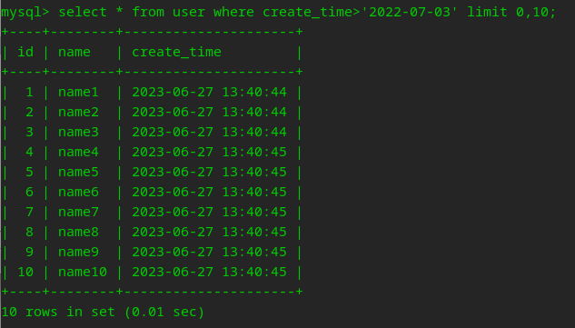
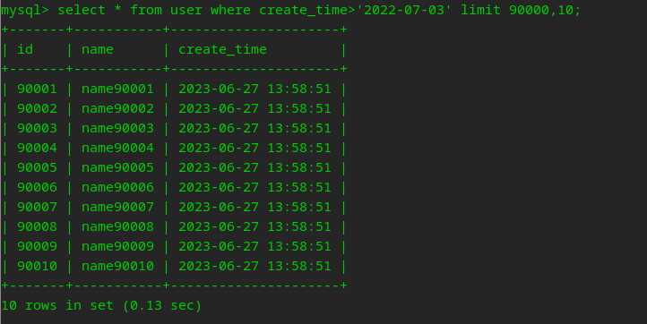
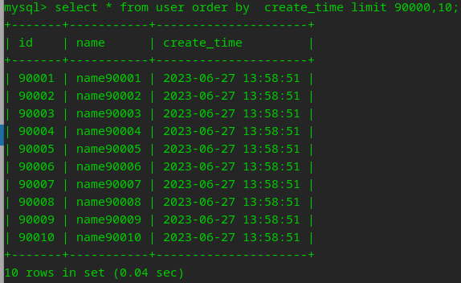

---
layout: post
title: "MySQL实践"
date: 2023-06-27 
description: "深度分页查询效率窥探"

tag: MySQL
---  

开发经常遇到分页查询的需求，但是当翻页过多的时候，就会产生深分页，导致查询效率急剧下降。那是什么原因导致查询效率下降，又如何来解决这个问题呢？

## 1、准备数据

创建一张用户表，只在`create_time`添加索引

```sql
CREATE TABLE `user` (
  `id` int NOT NULL AUTO_INCREMENT COMMENT '主键',
  `name` varchar(255) DEFAULT NULL COMMENT '姓名',
  `create_time` timestamp NULL DEFAULT NULL COMMENT '创建时间',
  PRIMARY KEY (`id`),
  KEY `idx_create_time` (`create_time`)
) ENGINE=InnoDB COMMENT='用户表';
```

使用存储过程，往用户表中插入10万条测试数据

```sql
drop PROCEDURE IF EXISTS insertData;
DELIMITER $$
create procedure insertData()
begin
 declare i int default 1;
   while i <= 100000 do
         INSERT into user (name,create_time) VALUES (CONCAT("name",i), now());
         set i = i + 1; 
   end while; 
end $$

call insertData() $$
```

### 2、复现问题

每页10条，当我们查询第一页的时候，速度很快：

```sql
select * from user where create_time>'2022-07-03' limit 0,10;
```



```sql
select * from user where create_time>'2022-07-03' limit 90000,10;
```



```sql
select * from user order by create_time limit 90000,10;
```



执行时间分别变成了0.13、0.04秒，性能下降了几十倍。

耗时花费在哪里了呢？

- create_time是非聚簇索引，需要先查询出主键ID，再**回表**查询，通过主键ID查询出所有字段。
- 使用order by，通过explain发现使用了 `Using filesort`

其中索引有两个功能：查找和排序。