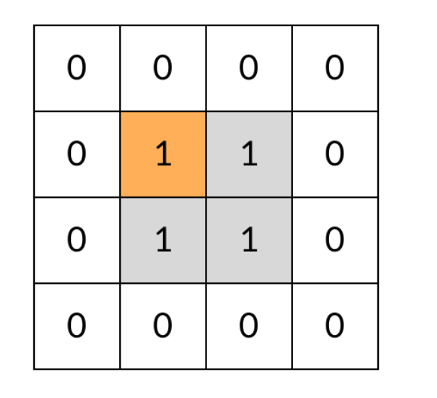

---
layout: post
title: "可信专题"
date: 2023-08-14 
description: "双指针、正则匹配"

tag: 算法
---  

# simple

## **1813. 【软件认证】用给定的数字组成IP地址**

### **题目描述**

一个IPv4地址可用点分十进制表示，格式为x1.x2.x3.x4，对合法的定义简化为：

- x1、x2、x3、x4 的合法范围均为 [0, 255]，分隔符是字符`.`。
- 不考虑IP地址的具体含义，比如 `0.0.0.0`、`255.255.255.255`也是合法的。

现给定一个仅含数字字符的字符串，请问由这些数字字符配合分隔符共能组合成多少个不同的IPv4地址？

约定：

- 每个数字字符可以重复使用。
- ip地址的每段不含前导零， 8.8.8.8 和 08.08.008.008 是相同的IP地址，其转换为十进制数后也是相同的。

**输入**

一个字符串，仅为数字字符且彼此不重复。字符串长度范围[1, 10]

**输出**

一个整数，表示符合要求的的IPv4地址的数量。

**样例**

输入样例 1 复制

```
23
```

输出样例 1

```
10000
```

提示样例 1

由 `2`、`3` 能够组合成 10 个不同的 0~255 的整数，分别为：
2、3、22、23、32、33、222、223、232、233。
该IP地址的每个字段都有10种组合，那么四个字段共有10000（即10^4）个不同的IPv4地址。

### **思路**

就是看你给的这个字符串有多少能在0-255范围内，再 pow(count,4)

```java
    public static long composeIpAddress(String nums) {
        // 在此补充你的代码
        // 主要是这个正则表达式
        String regex = "[" + nums + "]+";
        int cnt = 0;
        for (int i = 0; i <= 255; i++) {
            if (String.valueOf(i).matches(regex)) {
                cnt++;
            }
        }
        return (long) Math.pow(cnt, 4);
    }
```


## 1901.四则运算求值（[面试题 16.26. 计算器](https://leetcode.cn/problems/calculator-lcci/)）<多做几次>

### 题目描述

给定一个包含正整数、加(+)、减(-)、乘(*)、除(/)的算数表达式(括号除外)，计算其结果。

表达式仅包含非负整数，`+`， `-` ，`*`，`/` 四种运算符和空格 ` `。 整数除法仅保留整数部分。

**示例1：**

```
输入: "3+2*2"
输出: 7
```

**示例2：**

```
输入: 1+2*3-100/2
输出：-43
```

### 思路

sign存储的是前一个算数表达式

```java
private static String calculate(String expression) {
    Stack<Integer> stack = new Stack<>();
    int num = 0;
    char sign = '+';
    for (int i = 0; i < expression.length(); i++) {
        char c = expression.charAt(i);
        if (Character.isDigit(c)) {
            // 此处处理100的值
            num = num * 10 + (c - '0');
        }
        if (!Character.isDigit(c) || i == expression.length() - 1) {
            switch (sign) {
                case '+':
                    stack.add(num);
                    break;
                case '-':
                    stack.add(-num);
                    break;
                case '*':
                    stack.add(stack.pop() * num);
                    break;
                case '/':
                    if (num == 0) {
                        return "error";
                    } else {
                        stack.add(stack.pop() / num);
                    }
                    break;
                default:
                    break;
            }
            sign = c;
            num = 0;
        }
    }
    int sum = 0;
    while (!stack.isEmpty()) {
        sum += stack.pop();
    }
    return String.valueOf(sum);
}
```

## **1900. 【软件认证】字符排序**

### **题目描述**

给定一个字符串，仅含英文字母和数字，请按如下规则对其进行排序：

- 排序后，原位置是数字的，排序后仍然是数字；原位置是字母的，排序后仍然是字母。
- 数字：按 0-9 升序。
- 英文字母：大写字母大于小写字母，小写字母按 a-z 升序，大写字母按 A-Z 升序。

**示例1**

```
输入：a2CB1c
输出：a1cB2C
```

### 思路

将数字、小写字母、大写字母分别用不同的字符串数组排序处理，再进行拼接

```java
private static String characterSort(String inputStr) {
    String[] digit = new String[inputStr.length()];
    String[] lowLetter = new String[inputStr.length()];
    String[] UpLetter = new String[inputStr.length()];
    // 记录字符还是数字
    String[] temp = new String[inputStr.length()];
    int digitNum = 0;
    int lowLetterNum = 0;
    int upLetterNum = 0;
    for (int i = 0; i < inputStr.length(); i++) {
        char c = inputStr.charAt(i);
        if (Character.isDigit(c)) {
            temp[i] = "d";
            digit[digitNum++] = String.valueOf(c);
            lowLetter[lowLetterNum++] = "|";
            UpLetter[upLetterNum++] = "|";
        } else if (Character.isLowerCase(c)) {
            temp[i] = "l";
            digit[digitNum++] = "|";
            lowLetter[lowLetterNum++] = String.valueOf(c);
            UpLetter[upLetterNum++] = "|";
        } else {
            temp[i] = "l";
            digit[digitNum++] = "|";
            lowLetter[lowLetterNum++] = "|";
            UpLetter[upLetterNum++] = String.valueOf(c);
        }
    }
    Arrays.sort(digit);
    Arrays.sort(lowLetter);
    Arrays.sort(UpLetter);
    StringBuilder res = new StringBuilder();
    digitNum = 0;
    lowLetterNum = 0;
    upLetterNum = 0;
    for (int i = 0; i < temp.length; i++) {
        String str = temp[i];
        if (str == "d") {
            res.append(digit[digitNum++]);
        } else if (str == "l") {
            if (lowLetter[lowLetterNum] != "|") {
                res.append(lowLetter[lowLetterNum++]);
            } else {
                res.append(UpLetter[upLetterNum++]);
            }
        }
    }
    return res.toString();
}
```


## 二维数组专题

### 遍历篇

#### [1380. 矩阵中的幸运数](https://leetcode.cn/problems/lucky-numbers-in-a-matrix/)

给你一个 `m * n` 的矩阵，矩阵中的数字 **各不相同** 。请你按 **任意** 顺序返回矩阵中的所有幸运数。

**幸运数** 是指矩阵中满足同时下列两个条件的元素：

- 在同一行的所有元素中最小
- 在同一列的所有元素中最大

```java
class Solution {
    public List<Integer> luckyNumbers (int[][] matrix) {
        int m = matrix.length;
        int n = matrix[0].length;
         // 求行、列
        int[] minRow = new int[m];
        Arrays.fill(minRow, Integer.MAX_VALUE);
        int[] maxCol = new int[n];
        for (int i = 0;i < m; i++) {
            for (int j = 0; j < n; j++) {
                // 求每一行最小值
                minRow[i] = Math.min(minRow[i], matrix[i][j]);
                // 求每一列最大值
                maxCol[j] = Math.max(maxCol[j], matrix[i][j]);
            }
        }
        // 有点类似，1582题
        List<Integer> res = new ArrayList<>();
        for (int i = 0;i < m; i++) {
            for (int j = 0; j < n; j++) {
                if (matrix[i][j] == minRow[i] && matrix[i][j] == maxCol[j]) {
                    res.add(matrix[i][j]);
                }
            }
        }
        return res;
    }
}
```

#### [1572. 矩阵对角线元素的和](https://leetcode.cn/problems/matrix-diagonal-sum/)

给你一个正方形矩阵 `mat`，请你返回矩阵对角线元素的和。

请你返回在矩阵主对角线上的元素和副对角线上且不在主对角线上元素的和。

```java
class Solution {
    public int diagonalSum(int[][] mat) {
        int res = 0;
        int len = mat.length;
        // 注意分析求解值中，矩阵元素间的关系     
        // 与1672、766相似，主要要找到各元素的关系
        for (int i = 0; i < len; i++) {
            for (int j = 0; j < len; j++) {
                if (i == j || i + j == len - 1) {
                    res += mat[i][j];
                }
            }
        }
        return res;
    }
}
```

#### [1672. 最富有客户的资产总量](https://leetcode.cn/problems/richest-customer-wealth/)

给你一个 `m x n` 的整数网格 `accounts` ，其中 `accounts[i][j]` 是第 `i` 位客户在第 `j` 家银行托管的资产数量。返回最富有客户所拥有的 **资产总量** 。

客户的 **资产总量** 就是他们在各家银行托管的资产数量之和。最富有客户就是 **资产总量** 最大的客户。

```java
class Solution {
    public int maximumWealth(int[][] accounts) {
        int max = 0;
        for (int i = 0; i < accounts.length; i++) {
            int curSum = 0;
            for (int j = 0; j < accounts[0].length; j++) {
                curSum += accounts[i][j]; 
            }
            max = Math.max(max, curSum);
        }
        return max;
    }
}
```

#### [766. 托普利茨矩阵](https://leetcode.cn/problems/toeplitz-matrix/)

给你一个 `m x n` 的矩阵 `matrix` 。如果这个矩阵是托普利茨矩阵，返回 `true` ；否则，返回 `false` *。*

如果矩阵上每一条由左上到右下的对角线上的元素都相同，那么这个矩阵是 **托普利茨矩阵** 。

```java
class Solution {
    public boolean isToeplitzMatrix(int[][] matrix) {
        int m = matrix.length;
        int n = matrix[0].length;
        boolean res = true;
        for (int i = 1; i < m; i++) {
            for (int j = 1;  j < n; j++) {
                if (matrix[i][j] != matrix[i - 1][j - 1]) {
                    return false;
                }
            }
        }
        return true;
    }
}
```

#### [1582. 二进制矩阵中的特殊位置](https://leetcode.cn/problems/special-positions-in-a-binary-matrix/)

给你一个大小为 `rows x cols` 的矩阵 `mat`，其中 `mat[i][j]` 是 `0` 或 `1`，请返回 **矩阵 \*`mat`\* 中特殊位置的数目** 。

**特殊位置** 定义：如果 `mat[i][j] == 1` 并且第 `i` 行和第 `j` 列中的所有其他元素均为 `0`（行和列的下标均 **从 0 开始** ），则位置 `(i, j)` 被称为特殊位置。

```java
class Solution {
    public int numSpecial(int[][] mat) {
        int m = mat.length;
        int n = mat[0].length;
        // 求行和、列和
        int[] row = new int[m];
        int[] col = new int[n];
        for (int i = 0; i < m; i++) {
            for (int j = 0; j < n; j++) {
                row[i] += mat[i][j];
                col[j] += mat[i][j];
            }
        }
        int res = 0;
        for (int i = 0; i < m; i++) {
            for (int j = 0; j < n; j++) {
                if (mat[i][j] == 1 && row[i] == 1 && col[j] == 1) {
                    res++;
                }
            }
        }
        return res;
    }
}
```

总结：

二维数组的遍历

- 注意观察二维数组中元素间关系
- 注意是否与行和、列和有关系


### 二维数组与DFS

**如何在网格上做 DFS**
网格问题是这样一类搜索问题：有 m×nm \times nm×n 个小方格，组成一个网格，每个小方格与其上下左右四个方格认为是相邻的，要在这样的网格上进行某种搜索。这种题目乍一看可能有点麻烦，实际上非常简单，尤其是用 DFS 的方法。题目没有限制的话，我们尽量用 DFS 来写代码。

下面我们一步步地构造出方格类 DFS 的代码。

首先，每个方格与其上下左右的四个方格相邻，则 DFS 每次要分出四个岔：

```java
// 基本的 DFS 框架：每次搜索四个相邻方格
void dfs(int[][] grid, int r, int c) {
    dfs(grid, r - 1, c); // 上边相邻
    dfs(grid, r + 1, c); // 下边相邻
    dfs(grid, r, c - 1); // 左边相邻
    dfs(grid, r, c + 1); // 右边相邻
}
```

但是，对于网格边缘的方格，上下左右并不都有邻居。一种做法是在递归调用之前判断方格的位置，例如位于左边缘，则不访问其左邻居。但这样一个一个判断写起来比较麻烦，我们可以用“先污染后治理”的方法，先做递归调用，再在每个 DFS 函数的开头判断坐标是否合法，不合法的直接返回。同样地，我们还需要判断该方格是否有岛屿（值是否为 1），否则也需要返回。

```java
// 处理方格位于网格边缘的情况
void dfs(int[][] grid, int r, int c) {
    // 若坐标不合法，直接返回
    if (!(0 <= r && r < grid.length && 0 <= c && c < grid[0].length)) {
        return;
    }
    // 若该方格不是岛屿，直接返回
    if (grid[r][c] != 1) {
        return;
    }
    dfs(grid, r - 1, c);
    dfs(grid, r + 1, c);
    dfs(grid, r, c - 1);
    dfs(grid, r, c + 1);
}

```

但是这样还有一个问题：DFS 可能会不停地“兜圈子”，永远停不下来，如下图所示：



那么我们需要标记遍历过的方格，保证方格不进行重复遍历。标记遍历过的方格并不需要使用额外的空间，只需要改变方格中存储的值就可以。在这道题中，值为 0 表示非岛屿（不可遍历），值为 1 表示岛屿（可遍历），我们用 2 表示已遍历过的岛屿。

这样，我们就得到了网格 DFS 遍历的框架代码：

```java
// 处理方格位于网格边缘的情况
void dfs(int[][] grid, int r, int c) {
    // 若坐标不合法，直接返回
    if (!(0 <= r && r < grid.length && 0 <= c && c < grid[0].length)) {
        return;
    }
    // 若该方格不是岛屿，直接返回
    if (grid[r][c] != 1) {
        return;
    }
    grid[r][c] = 2;
    dfs(grid, r - 1, c);
    dfs(grid, r + 1, c);
    dfs(grid, r, c - 1);
    dfs(grid, r, c + 1);
}
```

#### [200. 岛屿数量](https://leetcode.cn/problems/number-of-islands/)

给你一个由 `'1'`（陆地）和 `'0'`（水）组成的的二维网格，请你计算网格中岛屿的数量。

岛屿总是被水包围，并且每座岛屿只能由水平方向和/或竖直方向上相邻的陆地连接形成。

此外，你可以假设该网格的四条边均被水包围。

```java
class Solution {
    public int numIslands(char[][] grid) {
        // 记录岛屿数量
        int count = 0;
        for (int i=0; i < grid.length; i++) {
            for (int j=0; j < grid[0].length; j++) {
                if (grid[i][j] == '1') {
                    dfs(grid, i, j);
                    count++;
                }
            }
        }
        return count;
    }

    public void dfs(char[][] grid, int i, int j) {
        // 合并了一下条件
        if (i < 0 || j < 0 || i >= grid.length || j >= grid[0].length || grid[i][j] != '1')
            return;
        grid[i][j] = '2';
        dfs(grid, i+1, j);
        dfs(grid, i, j+1);
        dfs(grid, i, j-1);
        dfs(grid, i-1, j);
    }
}
```

#### [695. 岛屿的最大面积](https://leetcode.cn/problems/max-area-of-island/)

给你一个大小为 `m x n` 的二进制矩阵 `grid` 。

**岛屿** 是由一些相邻的 `1` (代表土地) 构成的组合，这里的「相邻」要求两个 `1` 必须在 **水平或者竖直的四个方向上** 相邻。你可以假设 `grid` 的四个边缘都被 `0`（代表水）包围着。

岛屿的面积是岛上值为 `1` 的单元格的数目。

计算并返回 `grid` 中最大的岛屿面积。如果没有岛屿，则返回面积为 `0` 。

```java
class Solution {
    public int maxAreaOfIsland(int[][] grid) {
        int max = 0;
        for (int i=0; i < grid.length; i++) {
            for (int j=0; j < grid[0].length; j++) {
                if (grid[i][j] == 1) {
                    max = Math.max(max, dfs(grid, i, j));
                }
            }
        }
        return max;
    }

    public int dfs(int[][] grid, int r, int c) {
        if (r < 0 || c < 0 || r >= grid.length || c >= grid[0].length) {
            return 0;
        }
        if (grid[r][c] == 0) {
            return 0;
        }
        grid[r][c] = 0;
        // 记得用变量记录一下个数
        int sum = 1;
        sum += dfs(grid, r - 1, c);
        sum += dfs(grid, r + 1, c);
        sum += dfs(grid, r, c - 1);
        sum += dfs(grid, r, c + 1);
        return sum;
    }
}
```

#### [463. 岛屿的周长](https://leetcode.cn/problems/island-perimeter/)

给定一个 `row x col` 的二维网格地图 `grid` ，其中：`grid[i][j] = 1` 表示陆地， `grid[i][j] = 0` 表示水域。

网格中的格子 **水平和垂直** 方向相连（对角线方向不相连）。整个网格被水完全包围，但其中恰好有一个岛屿（或者说，一个或多个表示陆地的格子相连组成的岛屿）。

岛屿中没有“湖”（“湖” 指水域在岛屿内部且不和岛屿周围的水相连）。格子是边长为 1 的正方形。网格为长方形，且宽度和高度均不超过 100 。计算这个岛屿的周长。

**解析**

求岛屿的周长其实有很多种方法，如果用 DFS 遍历来求的话，有一种很简单的思路：岛屿的周长就是岛屿方格和非岛屿方格相邻的边的数量。注意，这里的非岛屿方格，既包括水域方格，也包括网格的边界。我们可以画一张图，看得更清晰：


```java
class Solution {
    public int islandPerimeter(int[][] grid) {
        for (int r = 0; r < grid.length; r++) {
            for (int c = 0; c < grid[0].length; c++) {
                if (grid[r][c] == 1) {
                    return dfs(grid, r, c);
                }
            }
        }
        return 0;
    }

    public int dfs(int[][] grid, int r, int c) {
        if (r < 0 || c < 0 || r >= grid.length || c >= grid[0].length)
            return 1;
        if (grid[r][c] == 0) {
            return 1;
        }
        if (grid[r][c] != 1) {
            return 0;
        }
        grid[r][c] = 2;
        return dfs(grid, r - 1, c) + dfs(grid, r + 1, c) + dfs(grid, r, c - 1) + dfs(grid, r, c + 1);
    }
}
```


## LeetCode 系统设计题

### [155. 最小栈](https://leetcode.cn/problems/min-stack/)

设计一个支持 `push` ，`pop` ，`top` 操作，并能在常数时间内检索到最小元素的栈。

实现 `MinStack` 类:

- `MinStack()` 初始化堆栈对象。
- `void push(int val)` 将元素val推入堆栈。
- `void pop()` 删除堆栈顶部的元素。
- `int top()` 获取堆栈顶部的元素。
- `int getMin()` 获取堆栈中的最小元素。

**示例 1:**

```
输入：
["MinStack","push","push","push","getMin","pop","top","getMin"]
[[],[-2],[0],[-3],[],[],[],[]]

输出：
[null,null,null,null,-3,null,0,-2]

解释：
MinStack minStack = new MinStack();
minStack.push(-2);
minStack.push(0);
minStack.push(-3);
minStack.getMin();   --> 返回 -3.
minStack.pop();
minStack.top();      --> 返回 0.
minStack.getMin();   --> 返回 -2.
```


```java
class MinStack {
	// 此处不能用一个变量来存储最小值
 	private Stack<Integer> minStack;
    private Stack<Integer> stack;
    
    public MinStack() {
	     stack = new Stack<>();
      minStack = new Stack<>();
    }
    
    public void push(int val) {
      stack.push(val);
      if (!minStack.isEmpty()) {
          int top = minStack.peek();
          if (val <= top) {
            minStack.push(val);
          }
      } else {
        minStack.push(val);
      }
    }
    
    public void pop() {
      int val = stack.pop();
      if (minStack.peek() == val) {
        minStack.pop();
      }
    }
    
    public int top() {
	  return stack.peek();
    }
    
    public int getMin() {
      return minStack.peek();
    }
}
```

### [232. 用栈实现队列](https://leetcode.cn/problems/implement-queue-using-stacks/)

请你仅使用两个栈实现先入先出队列。队列应当支持一般队列支持的所有操作（`push`、`pop`、`peek`、`empty`）：

实现 `MyQueue` 类：

- `void push(int x)` 将元素 x 推到队列的末尾
- `int pop()` 从队列的开头移除并返回元素
- `int peek()` 返回队列开头的元素
- `boolean empty()` 如果队列为空，返回 `true` ；否则，返回 `false`

**示例 1：**

```
输入：
["MyQueue", "push", "push", "peek", "pop", "empty"]
[[], [1], [2], [], [], []]
输出：
[null, null, null, 1, 1, false]

解释：
MyQueue myQueue = new MyQueue();
myQueue.push(1); // queue is: [1]
myQueue.push(2); // queue is: [1, 2] (leftmost is front of the queue)
myQueue.peek(); // return 1
myQueue.pop(); // return 1, queue is [2]
myQueue.empty(); // return false
```


```java
class MyQueue {

    private Stack<Integer> stack1;
    private Stack<Integer> stack2;

    public MyQueue() {
        stack1 = new Stack<>();
        stack2 = new Stack<>();
    }
    
    public void push(int x) {
        stack1.push(x);
    }
    
    public int pop() {
        if (stack2.isEmpty()) {
            while (!stack1.isEmpty()) {
                stack2.push(stack1.pop());
            }
        }
        return stack2.pop();
    }
    
    public int peek() {
        if (stack2.isEmpty()) {
            while (!stack1.isEmpty()) {
                stack2.push(stack1.pop());
            }
        }
        return stack2.peek();
    }
    
    public boolean empty() {
        return stack1.isEmpty() && stack2.isEmpty();
    }
}
```


 

### [225. 用队列实现栈](https://leetcode.cn/problems/implement-stack-using-queues/)

请你仅使用两个队列实现一个后入先出（LIFO）的栈，并支持普通栈的全部四种操作（`push`、`top`、`pop` 和 `empty`）。

实现 `MyStack` 类：

- `void push(int x)` 将元素 x 压入栈顶。
- `int pop()` 移除并返回栈顶元素。
- `int top()` 返回栈顶元素。
- `boolean empty()` 如果栈是空的，返回 `true` ；否则，返回 `false` 。

```java
// 两个队列实现栈，写错了，在pop的时候进行操作，应该在push的借用辅助队列
class MyStack {
    private Queue<Integer> queue1;
    private Queue<Integer> queue2;

    public MyStack() {
        queue1 = new LinkedList<>();
        queue2 = new LinkedList<>();
    }
    
    public void push(int x) {
        queue2.offer(x);
        while (!queue1.isEmpty()) {
            queue2.offer(queue1.poll());
        }
        Queue<Integer> temp = queue1;
        queue1 = queue2;
        queue2 = temp;
    }
    
    public int pop() {
        return queue1.poll();
    }
    
    public int top() {
        return queue1.peek();
    }
    
    public boolean empty() {
        return queue1.isEmpty() && queue2.isEmpty();
    }
}
```

