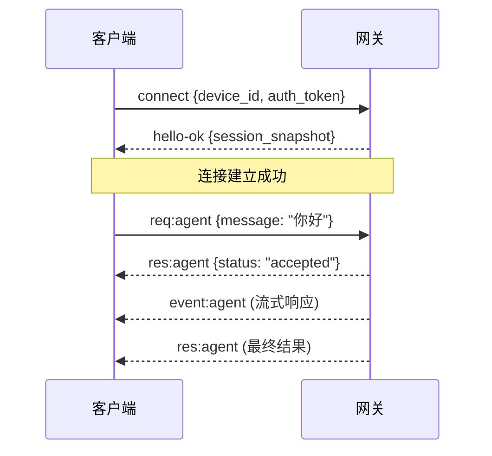

## 前言

OpenClaw 是一个**个人 AI 助手**，可以部署在你自己的设备上，通过你常用的消息渠道（微信、飞书、Telegram、Discord 等）与你交互。不同于云端 AI 服务，OpenClaw 运行在本地，数据更私密，响应更快，而且完全由你掌控。

本文将从架构角度深入解析 OpenClaw 的工作原理，帮助你理解如何定制属于自己的 AI 代理。

---

## 一、整体架构

OpenClaw 采用**网关（Gateway）+ 客户端（Clients）**的架构模式：

```
┌─────────────────────────────────────────────────────────────────┐
│                        OpenClaw 架构                             │
├─────────────────────────────────────────────────────────────────┤
│                                                                 │
│   ┌─────────────┐     WebSocket      ┌───────────────────────┐ │
│   │  macOS App  │◄──────────────────►│                       │ │
│   ├─────────────┤                    │                       │ │
│   │    CLI      │◄──────────────────►│                       │ │
│   ├─────────────┤                    │      Gateway          │ │
│   │  Web UI     │◄──────────────────►│    (WebSocket)        │ │
│   ├─────────────┤                    │     Port: 18789       │ │
│   │   Nodes     │◄──────────────────►│                       │ │
│   │ (iOS/安卓)  │                    │                       │ │
│   └─────────────┘                    └───────────┬───────────┘ │
│                                                  │             │
│                                      ┌───────────┴───────────┐ │
│                                      │    消息渠道适配层      │ │
│                                      ├───────────────────────┤ │
│                                      │ WhatsApp | Telegram   │ │
│                                      │ Discord  | Slack      │ │
│                                      │ 飞书     | Signal     │ │
│                                      │ iMessage | WebChat    │ │
│                                      └───────────────────────┘ │
│                                                                 │
└─────────────────────────────────────────────────────────────────┘
```

### 核心组件

| 组件 | 职责 |
|------|------|
| **Gateway** | 网关守护进程，管理所有消息渠道连接，处理 WebSocket 通信，协调 Agent 运行 |
| **Clients** | 控制平面客户端（macOS 应用、CLI、Web UI），通过 WebSocket 与 Gateway 通信 |
| **Nodes** | 设备节点（macOS/iOS/Android），提供摄像头、屏幕录制、定位等设备能力 |
| **Agent Runtime** | AI 代理运行时，负责工具调用、会话管理、记忆持久化 |

---

## 二、通信协议

### 2.1 WebSocket 握手流程

所有客户端必须通过 WebSocket 连接到 Gateway（默认端口 18789），连接建立后需要进行**握手认证**：



### 2.2 消息类型

| 类型 | 方向 | 说明 |
|------|------|------|
| `req` | Client → Gateway | 请求消息，需要等待响应 |
| `res` | Gateway → Client | 响应消息，与请求一一对应 |
| `event` | Gateway → Client | 事件推送，无需响应 |

### 2.3 安全机制

- **Token 认证**：可配置 `OPENCLAW_GATEWAY_TOKEN`，客户端必须携带正确的 token
- **设备配对**：新设备首次连接需要审批，审批后颁发设备令牌
- **本地信任**：本地回环连接可自动审批，远程连接需要显式授权

---

## 三、Agent 运行时

Agent 是 OpenClaw 的"大脑"，负责理解用户意图、调用工具、维护对话上下文。

### 3.1 工作空间（Workspace）

每个 Agent 都有一个独立的工作空间目录，用于存储：

```
~/.openclaw/workspace/
├── AGENTS.md      # Agent 行为规范
├── SOUL.md        # 个性设定
├── USER.md        # 用户信息
├── TOOLS.md       # 工具使用笔记
├── MEMORY.md      # 长期记忆
└── memory/        # 每日记录
    └── 2026-03-24.md
```

这些文件会在每次会话开始时**自动注入**到 Agent 的上下文中，让它"记住"你是谁、你的偏好是什么。

### 3.2 工具系统

OpenClaw 内置了丰富的工具：

| 工具类别 | 示例工具 |
|---------|---------|
| 文件操作 | `read`, `write`, `edit` |
| 命令执行 | `exec` (支持 PTY) |
| 网络请求 | `web_search`, `web_fetch` |
| 浏览器控制 | `browser` (自动化) |
| 消息发送 | `message` (多渠道) |
| 日程管理 | `cron` (定时任务) |
| 设备控制 | `nodes` (摄像头/屏幕) |

### 3.3 会话管理

OpenClaw 支持多种会话隔离模式：

```json5
// 配置示例
{
  session: {
    dmScope: "per-channel-peer",  // DM 按渠道+用户隔离
    reset: {
      mode: "daily",   // 每日重置
      atHour: 4,       // 凌晨 4 点
    }
  }
}
```

**会话类型**：
- `main` - 主会话，跨设备持续
- `per-peer` - 按用户隔离
- `per-channel-peer` - 按渠道+用户隔离（推荐多用户场景）

---

## 四、多渠道接入原理

OpenClaw 的强大之处在于**统一的消息抽象层**，让你可以通过同一个 AI 在不同渠道交流。

### 4.1 渠道适配

```
┌──────────────┐     ┌──────────────┐     ┌──────────────┐
│  WhatsApp    │     │   Telegram   │     │    飞书      │
│  (Baileys)   │     │   (grammY)   │     │   (API)      │
└──────┬───────┘     └──────┬───────┘     └──────┬───────┘
       │                    │                    │
       └────────────────────┼────────────────────┘
                            │
                   ┌────────▼────────┐
                   │   消息适配层     │
                   │  (标准化格式)    │
                   └────────┬────────┘
                            │
                   ┌────────▼────────┐
                   │   Agent Core    │
                   └─────────────────┘
```

### 4.2 消息流转

1. **入站**：用户在任意渠道发送消息 → 渠道适配器 → Gateway → Agent 处理
2. **出站**：Agent 生成回复 → Gateway → 渠道适配器 → 发送到对应渠道

无论你从哪个渠道发消息，Agent 都能识别你的身份，维持连续的对话上下文。

---

## 五、快速上手

### 5.1 安装

```bash
# 全局安装
npm install -g openclaw@latest

# 运行配置向导
openclaw onboard --install-daemon
```

### 5.2 启动 Gateway

```bash
openclaw gateway --port 18789 --verbose
```

### 5.3 发送消息

```bash
# 通过 CLI 发送
openclaw message send --to +1234567890 --message "Hello from OpenClaw"

# 与 Agent 对话
openclaw agent --message "帮我整理今天的待办事项" --thinking high
```

---

## 六、典型应用场景

### 6.1 个人知识库助手

将每日学习笔记自动同步到博客：

```
用户: "把今天的笔记发布到博客"
Agent: [读取 memory/2026-03-24.md] 
       → [转换为 Jekyll 格式]
       → [提交到 GitHub]
       → "已发布到 https://your-blog.github.io"
```

### 6.2 智能日程管理

```
用户: "帮我查一下明天下午 3 点有没有空"
Agent: [调用日历 API]
       → "明天下午 3 点已有一个会议，4 点后有空"
       → "需要我帮你约这个时间段吗？"
```

### 6.3 远程设备控制

```
用户: "拍一张家里的照片"
Agent: [通过 Node 调用摄像头]
       → [返回图片]
       → "这是客厅的实时画面"
```

---

## 七、最佳实践

### 7.1 安全配置

```json5
// ~/.openclaw/openclaw.json
{
  gateway: {
    auth: {
      token: "your-secure-token-here"
    }
  },
  session: {
    dmScope: "per-channel-peer"  // 多用户必须开启
  }
}
```

### 7.2 性能优化

- 定期清理会话：`openclaw sessions cleanup --enforce`
- 配置会话维护策略：限制最大条目数、过期时间
- 使用 Tailscale 或 VPN 进行远程访问，避免暴露端口

### 7.3 调试技巧

```bash
# 查看状态
openclaw status

# 查看会话
openclaw sessions --json

# 健康检查
openclaw doctor
```

---

## 八、总结

OpenClaw 是一个设计精良的个人 AI 助手框架，核心特点：

| 特性 | 说明 |
|------|------|
| 🔒 **本地优先** | 数据在自己设备上，隐私可控 |
| 🔌 **多渠道接入** | WhatsApp、Telegram、飞书等 20+ 渠道 |
| 🛠️ **工具丰富** | 文件、网络、浏览器、设备控制等 |
| 🧠 **记忆持久** | 工作空间文件自动注入上下文 |
| ⚡ **实时响应** | WebSocket 长连接，流式输出 |

如果你想要一个**真正属于自己**的 AI 助手，而不是把数据交给云端服务商，OpenClaw 是一个值得尝试的选择。

---

## 参考资料

- [OpenClaw 官网](https://openclaw.ai)
- [官方文档](https://docs.openclaw.ai)
- [GitHub 仓库](https://github.com/openclaw/openclaw)
- [Discord 社区](https://discord.gg/clawd)
